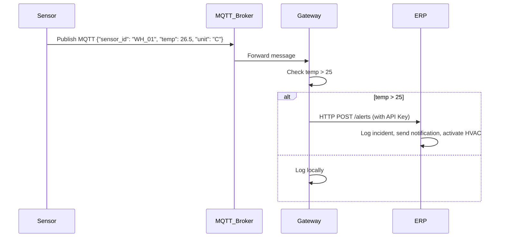

# Lab 8: IoT-to-IT Integration Flow

## Scenario
A smart warehouse where temperature sensors send data to a Gateway, which triggers an alert in an ERP system if temperature exceeds 25°C.

## Sequence Diagram

## Constraints Answers

1. **What happens if the warehouse Wi-Fi goes down?**  
   The sensors cannot publish to MQTT, data is lost until connection restores. Gateway could buffer locally if possible.

2. **How do you prevent someone from "spoofing" a high-temperature reading?**  
   Use authentication in MQTT (username/password), encrypt payloads, validate sensor IDs.

3. **What is the primary purpose of an IoT Gateway when connecting a sensor that uses a non-IP protocol to a cloud-based IoT system?**  
   To translate protocols (e.g., Zigbee to MQTT/IP) and provide internet connectivity.

4. **Why is MQTT generally preferred over HTTP for the initial link between a battery-powered sensor and a gateway?**  
   MQTT is lightweight, uses less bandwidth and power, supports publish/subscribe for efficient communication.

5. **Why is it more efficient to perform the temperature check at the Gateway (Edge) rather than inside the ERP system?**  
   Reduces network traffic, latency, and load on the ERP system by filtering irrelevant data at the edge.

6. **Describe one way a "Man-in-the-Middle" attack could affect the warehouse.**  
   An attacker could intercept MQTT messages, alter temperature readings to trigger false alerts or hide real issues, potentially causing operational disruptions.

## Implementation
Run the components:
- Start ERP: `node erp.js`
- Start Gateway: `node gateway.js`
- Start Sensor: `node sensor.js`